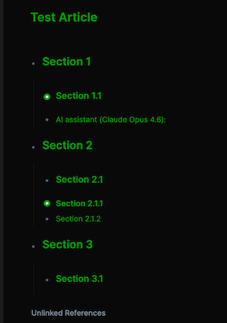

# Querying Roam Research

## Roam Database

Roam Research stores its graph in **[Datomic](https://www.datomic.com/)/[DataScript](https://github.com/tonsky/datascript)**. Roam Research acts as a bridge between the frontend and backend by using _DataScript_ as a local "mirror" of a _Datomic_ backend. Both store data as **Datoms** -- atomic facts. Whether a piece of data is in the cloud (backend) or in your browser (front end), it looks exactly the same. 

A datom is a 4-tuple of:
- **E (Entity ID):** The unique ID of a block.
- **A (Attribute):** The property (e.g., `:block/string` or `:block/children`).
- **V (Value):** The actual content or the ID of a child block.
- **T (Transaction ID):** The "when" and "who" of the change.

Every _node_ in the Roam graph (_page_ or _block_) is an **Entity** in this scheme; every property of that node is an **Attribute** asserted against the Entity. 


## Key Roam Attributes

These are the **Attributes** most relevant to this project's queries and data model:

| Attribute | Present on | Notes |
|---|---|---|
| `:db/id` | all entities | Datomic internal id; **not stable** across exports |
| `:block/uid` | all entities | Roam generated 9-char alphanumeric; **stable** identifier |
| `:node/title` | pages only | Distinguishes pages from blocks |
| `:block/string` | blocks only | Raw Markdown text of the block |
| `:block/order` | child blocks | Zero-based sibling position |
| `:block/heading` | heading blocks | 1, 2, or 3; absent means normal text |
| `:block/children` | blocks/pages | List of `IdObject` stubs (`:db/id` only) |
| `:block/parents` | blocks | All ancestor stubs up to page root |
| `:block/refs` | blocks | Pages/blocks referenced via `[[...]]` |
| `:block/page` | blocks | Containing page stub |
| `:entity/attrs` | some entities | Structured attribute assertions (`LinkObject`) |

As an example, for this Roam page ("Test Article"):



The following table shows the key Datoms (cells) for the 3 Roam _blocks_ (rows) that are the immediate children of the _Test Article_ _page_:

| `:db/id` | `:block/uid` | `:block/string` | `:block/page` | `:block/order` | `:block/heading` | `:block/parents` | `:block/children` |
|---|---|---|---|---|---|---|---|
| 3328 | `0EgPyHSZi` | Section 1 | `{id:3327}` | 0 | 2 | `[{id:3327}]` | `[{id:3331}, {id:4029}]` |
| 3329 | `wdMgyBiP9` | Section 2 | `{id:3327}` | 1 | 2 | `[{id:3327}]` | `[{id:3332}, {id:4025}, {id:4026}]` |
| 3330 | `40bvW14UU` | Section 3 | `{id:3327}` | 2 | 2 | `[{id:3327}]` | `[{id:3333}]` |

The full attribute schema discovered from a live graph is in [roam-schema.md](./roam-schema.md)

## Datalog Query Language
_Datomic_/_DataScript_ use [Datalog](https://en.wikipedia.org/wiki/Datalog) as the query language. _Datalog_ is a syntactic subset of Prolog, which is commonly used to interact with **deductive dabases**. A Datalog program consists of facts (Datoms), which are statements that are held to be true, and _Rules_, which say how to deduce new facts from known facts. 

## Datalog Query Structure

Queries follow standard Datomic Datalog syntax:

```
[:find  <find-spec>
 :in    $ <binding> ...      ; optional; $ is always the implicit db
 :where <clause> ...]
```

### Clauses

**Entity-attribute-value triple** — the fundamental constraint:

```
[?entity :attribute ?value]
```

- `?entity`, `?value` — logic variables (bound or free)
- `:attribute` — a namespaced keyword from the Roam schema (e.g. `:node/title`)
- `_` — wildcard; matches any entity/value without binding

**Built-in predicate** — called inside `[( ... )]`:

```
[(namespace ?attr) ?namespace]
```

Extracts the namespace portion of a keyword attribute (e.g. `:block/string` → `"block"`).

**Pull expression** — returns a map of attributes for a matched entity:

```
(pull ?entity [<pull-pattern>])
```

Common pull patterns used in this project:

| Pattern | Meaning |
|---|---|
| `[*]` | All attributes of the entity |
| `[:block/uid :block/string]` | Only those two attributes |

## Queries Used in This Project

### 1. Page fetch — `FetchRoamNodes.Request.BY_PAGE_TITLE_QUERY`

```datalog
[:find (pull ?page [*])
 :in $ ?title
 :where
 [?page :node/title ?title]]
```

- Input binding: `?title` — the exact page title string (passed as `args[1]`).
- Finds the entity whose `:node/title` equals the title, then pulls all its attributes.
- Returns `[row[0] for row in result]` — a `list[RoamNode]` where each `RoamNode` holds the full pull-block dict.


### 2. Schema introspection — `FetchRoamSchema.Request.DATALOG_SCHEMA_QUERY`

```datalog
[:find ?namespace ?attr
 :where
 [_ ?attr]
 [(namespace ?attr) ?namespace]]
```

- No input bindings; scans every attribute asserted on any entity (`_` wildcard).
- `(namespace ?attr)` extracts the namespace portion of each attribute keyword.
- Returns `[["block", :block/string], ["node", :node/title], ...]` — the full live schema.
- Results documented in `docs/roam-schema.md`.

## Input Binding Forms

| `:in` syntax | `args` value | Meaning |
|---|---|---|
| `?scalar` | `"string"` or number | Single scalar bound to the variable |
| `[?a ?b]` | `["val-a", "val-b"]` | Tuple binding — both values supplied together |
| `[?x ...]` | `["v1", "v2", ...]` | Collection binding — query runs once per element |

The database reference `$` is always `args[0]` implicitly; explicit bindings start at
`args[1]`.

## Pull Result Shape and Normalization

`pull [*]` returns a flat dict with **namespaced keyword keys** — but Roam's Local API
strips the leading colon and namespace slash, returning plain string keys:

```json
{ "uid": "abc123xyz", "title": "My Page", "children": [{"id": 42}] }
```

Nested references (`:block/children`, `:block/refs`, `:block/page`, `:block/parents`) are
returned as **`IdObject` stubs** — `{"id": <db-id>}` — not fully pulled sub-entities.
Resolving stubs to stable UIDs requires a second query pass or a recursive pull pattern.


## Datalog Rules

Rules are named, reusable Horn clauses that enable recursive queries. Syntax:

```datalog
[(rule-name ?var ...)
 <body-clause> ...]
```

A rule definition takes the following form:

```datalog
[(actor-movie ?name ?title)
    [?p :person/name ?name]
    [?m :movie/cast ?p]
    [?m :movie/title ?title]]
```

Rules are passed as an additional element of the `args` array and referenced in the
`:where` clause by name. They are the mechanism used for recursive graph traversal
(corresponding to `FetchRoamNodes.FollowLinksDirective.DEEP` in `roam_node_fetch.py`).

